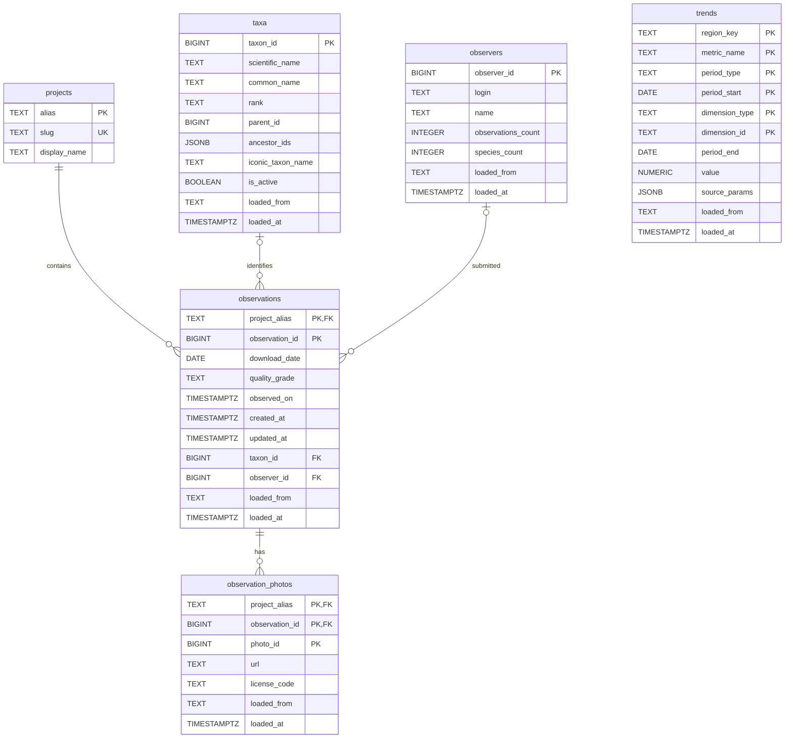

# Database schema

This diagram is derived from [`db/migrations/0001_initial_schema.sql`](../db/migrations/0001_initial_schema.sql). It shows the database entities, primary keys, and enforced foreign-key relationships. The migration remains the authoritative complete definition of every column and index.

`taxa.parent_id` and `taxa.ancestor_ids` describe the taxonomic hierarchy, but the migration does not declare a foreign key for them. They are therefore intentionally not shown as an enforced relationship in the diagram.

`trends` stores independent aggregate metrics, so it has no foreign-key relationship to the other tables.
